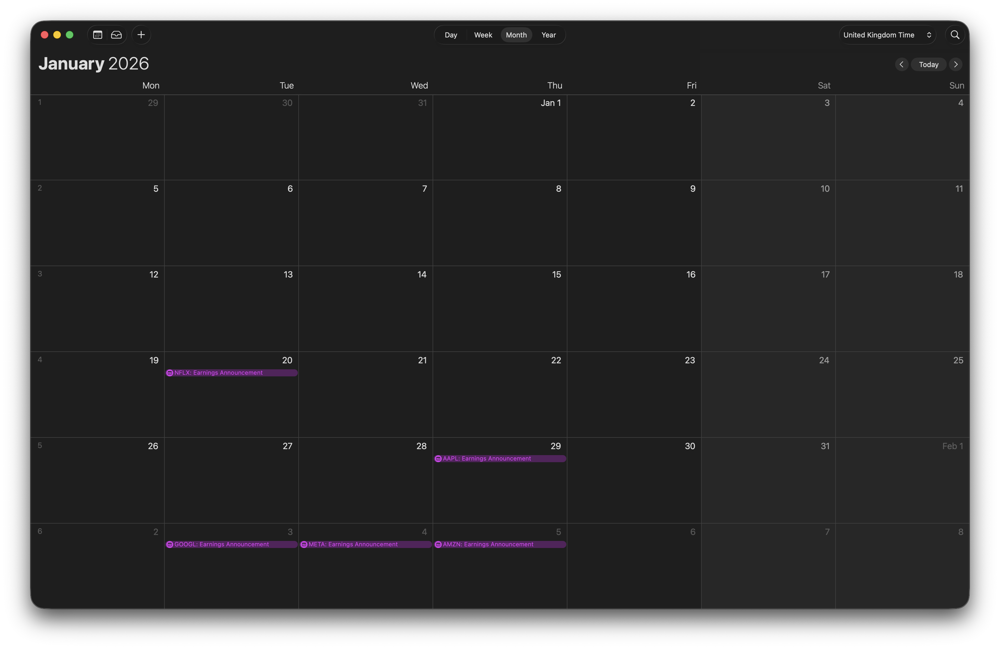

# Stock Ticker Calendar Tracker

[**Web App**](https://philippxxy.github.io/ticker-cal-tracker/) | [**Documentation**](https://philippxxy.github.io/ticker-cal-tracker/docs) | [**OpenAPI Swagger UI**](https://ticker-cal-tracker-1052233055044.europe-west2.run.app/docs)

The Stock Ticker Calendar Tracker puts upcoming stock events directly into your private calendar.
Create watchlists and subscribe to their calendar feeds to track earnings, dividends, and stock splits.

- Create one or more **watchlists** (e.g., `Long-Term`, `Dividend`, `Earnings Week`).
- Add **stocks** to each watchlist.
- Choose which **event types** should appear for that watchlist.
- Subscribe to the generated **`.ics` calendar feed** in your calendar app.

The backend refreshes event data regularly to keep feeds current.

The app runs serverless on **Google Cloud Run** with **Google Cloud SQL for PostgreSQL**.

## Key Features

### Watchlists to Calendars
Each watchlist has its own **calendar token** and **`.ics` URL**.
You can create multiple watchlists in different calendars and display only the ones you need.
Event dates are typically confirmed only for the near future and may change.
Share the URL to give others access to your watchlist.

### Supported Event Types
The app tracks `Earnings`, `Dividends` (declaration / ex-date / record / payment where available), and `Stock Splits`.

### Reminders and Filtering
Configure **filters** for each watchlist to show only certain event categories.
Set **reminder offsets** to get notifications before events (e.g., 1 day before).

### Safe Sharing Controls
Calendar access uses an unguessable **tokenized URL**.
If you need to revoke access, **rotate the calendar token** to invalidate existing feed links.

## Demonstration

Try the API endpoints in the [Swagger UI](https://ticker-cal-tracker-1052233055044.europe-west2.run.app/docs).

The [documentation](https://philippxxy.github.io/ticker-cal-tracker/docs) includes a full walkthrough with curl examples showing how to create a watchlist, add FAANG stocks, and subscribe to the calendar feed.

## Development

For information about the codebase and local setup, see the [documentation](https://philippxxy.github.io/ticker-cal-tracker/docs).

### Hosted Architecture

- **Serverless hosting:** Google **Cloud Run** for scaling
- **Database:** Google **Cloud SQL for PostgreSQL** for secure and backed up data

This setup scales on demand without managing servers.
The CI/CD pipeline runs checks and tests before each deployment.
