# Application Class Diagram

This diagram provides a comprehensive overview of the Ticker Calendar Tracker application architecture, showing the relationships between domain models, database schema, services, and external integrations. It illustrates how the system manages users, watchlists, stock data, and calendar functionality through a layered architecture pattern.

```puml
@startuml class_diagram_application
title Ticker Calendar Tracker - Application Class Diagram

' Domain Models
package "Models" {
  class User {
    +username: string
    +email: string
    +password_hash: string
    +created_at: datetime
    +id: integer
  }

  class Stock {
    +symbol: string
    +name: string
    +last_updated: datetime
  }

  enum EventType {
    EARNINGS_ANNOUNCEMENT
    DIVIDEND_EX
    DIVIDEND_DECLARATION
    DIVIDEND_RECORD
    DIVIDEND_PAYMENT
    STOCK_SPLIT
    --
    +db_column: string
  }

  class StockEvent {
    +stock: Stock
    +type: EventType
    +date: datetime
    +last_updated: datetime
    +source: string
  }
}

' Database Tables
package "Database Schema" {
  class users {
    +id: SERIAL {PK}
    +username: VARCHAR(50) {UNIQUE}
    +email: VARCHAR(100)
    +password_hash: VARCHAR(255)
    +created_at: TIMESTAMP
  }

  class stocks {
    +ticker: VARCHAR(20) {PK}
    +name: VARCHAR(255)
    +last_updated: TIMESTAMP
  }

  class stock_events {
    +id: UUID {PK}
    +stock_ticker: VARCHAR(20) {FK}
    +type: event_type
    +event_date: DATE
    +created_at: TIMESTAMP
    +last_updated: TIMESTAMP
    +source: VARCHAR(100)
  }

  class watchlists {
    +id: UUID {PK}
    +user_id: INTEGER {FK}
    +name: VARCHAR(255)
    +calendar_token: VARCHAR(255) {UNIQUE}
    +created_at: TIMESTAMP
  }

  class watchlist_settings {
    +watchlist_id: UUID {PK,FK}
    +include_earnings_announcement: BOOLEAN
    +include_dividend_ex: BOOLEAN
    +include_dividend_declaration: BOOLEAN
    +include_dividend_record: BOOLEAN
    +include_dividend_payment: BOOLEAN
    +include_stock_split: BOOLEAN
    +reminder_before: INTERVAL
    +created_at: TIMESTAMP
    +updated_at: TIMESTAMP
  }

  class follows {
    +watchlist_id: UUID {PK,FK}
    +stock_ticker: VARCHAR(20) {PK,FK}
    +created_at: TIMESTAMP
  }
}

' Services
package "Business Logic" {
  class UserService {
    -db: DatabaseAdapter
    +get_user(user_id: int): User
    +update_user(user_id: int, email: string): bool
  }

  class AuthService {
    -db: DatabaseAdapter
    +register_user(user_data: Dict): User
    +authenticate_user(username: string, password: string): User
    +create_token(user_id: int): string
  }

  class StocksService {
    -db: DatabaseAdapter
    -external_api: ExternalApiFacade
    +get_stock_from_ticker(ticker: string): Stock
    +upsert_stock_events(stock: Stock, event_types: List[EventType]): bool
  }

  class WatchlistService {
    -db: DatabaseAdapter
    -stocks_service: StocksService
    +create_watchlist(user_id: int, name: string, watchlist_settings: Dict): Dict
    +get_all_watchlists_for_user(user_id: int): List[Dict]
    +get_watchlist_by_id(user_id: int, watchlist_id: UUID): Dict
    +get_watchlist_stocks(user_id: int, watchlist_id: UUID): List[Dict]
    +update_watchlist(user_id: int, watchlist_id: UUID, name: string, watchlist_settings: Dict): bool
    +add_stock_to_watchlist(user_id: int, watchlist_id: UUID, stock_ticker: string): bool
    +remove_stock_to_watchlist(user_id: int, watchlist_id: UUID, stock_ticker: string): bool
    +delete_watchlist(user_id: int, watchlist_id: UUID): bool
  }

  class CalendarService {
    -db: DatabaseAdapter
    +get_calendar(token: string): string
    +rotate_calendar_token(user_id: int, watchlist_id: UUID): string
    +get_calendar_token(user_id: int, watchlist_id: UUID): string
  }
}

' External APIs
package "External Services" {
  interface ExternalApiBase {
    +getStockInfoFromSymbol(symbol: string): Stock
    +getStockEventDatesFromStock(stock: Stock, event_types: List[EventType]): List[StockEvent]
  }

  class ExternalApiFacade {
    -providers: List[ExternalApiBase]
    +getStockInfoFromSymbol(symbol: string): Stock
    +getStockEventDatesFromStock(stock: Stock, event_types: List[EventType]): List[StockEvent]
  }

  class AlphaVantage {
    -api_key: string
    +getStockInfoFromSymbol(symbol: string): Stock
    +getStockEventDatesFromStock(stock: Stock, event_types: List[EventType]): List[StockEvent]
  }

  class Finnhub {
    -api_key: string
    +getStockInfoFromSymbol(symbol: string): Stock
    +getStockEventDatesFromStock(stock: Stock, event_types: List[EventType]): List[StockEvent]
  }
}

' Database Adapters
package "Database" {
  interface DatabaseAdapterBase {
    +execute_query(query: string, params: Dict): Iterator
    +execute_update(query: string, params: Dict): int
    +close(): void
  }

  class DatabaseAdapterFactory {
    {static} +get_instance(): DatabaseAdapterBase
  }

  class LocalAdapter {
    -connection_string: string
    +execute_query(query: string, params: Dict): Iterator
    +execute_update(query: string, params: Dict): int
    +close(): void
  }

  class GCPAdapter {
    -connection_string: string
    +execute_query(query: string, params: Dict): Iterator
    +execute_update(query: string, params: Dict): int
    +close(): void
  }
}

' Background Tasks
package "Background Processing" {
  class TaskScheduler {
    -scheduler: BackgroundScheduler
    +start(): void
    +shutdown(): void
  }

  class BackgroundTasks {
    +update_stale_stock_events(): void
  }
}

' Relationships - Database Schema
users "1" -- "0..*" watchlists : owns
watchlists "1" -- "1" watchlist_settings : has
watchlists "1" -- "0..*" follows : contains
stocks "1" -- "0..*" follows : tracked by
stocks "1" -- "0..*" stock_events : has

' Relationships - Services
UserService ..> DatabaseAdapterBase : uses
AuthService ..> DatabaseAdapterBase : uses
StocksService ..> DatabaseAdapterBase : uses
StocksService ..> ExternalApiFacade : uses
WatchlistService ..> DatabaseAdapterBase : uses
WatchlistService ..> StocksService : uses
CalendarService ..> DatabaseAdapterBase : uses

' Relationships - External APIs
ExternalApiFacade ..|> ExternalApiBase
AlphaVantage ..|> ExternalApiBase
Finnhub ..|> ExternalApiBase
ExternalApiFacade o-- AlphaVantage : manages
ExternalApiFacade o-- Finnhub : manages

' Relationships - Database
DatabaseAdapterFactory ..> DatabaseAdapterBase : creates
LocalAdapter ..|> DatabaseAdapterBase
GCPAdapter ..|> DatabaseAdapterBase

' Relationships - Background Tasks
TaskScheduler ..> BackgroundTasks : schedules
BackgroundTasks ..> StocksService : uses

' Relationships - Models
StockEvent o-- Stock : contains
StockEvent o-- EventType : has

@enduml
```

