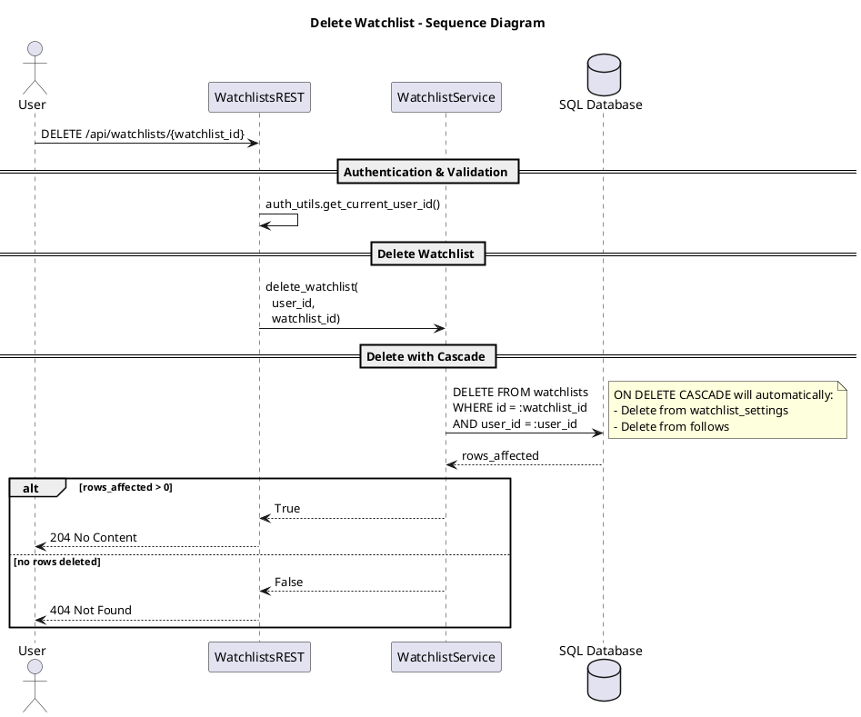

# Delete Watchlist

This diagram shows the process of deleting a watchlist owned by a user. The system uses cascade deletion to automatically remove associated watchlist settings and stock follows.

