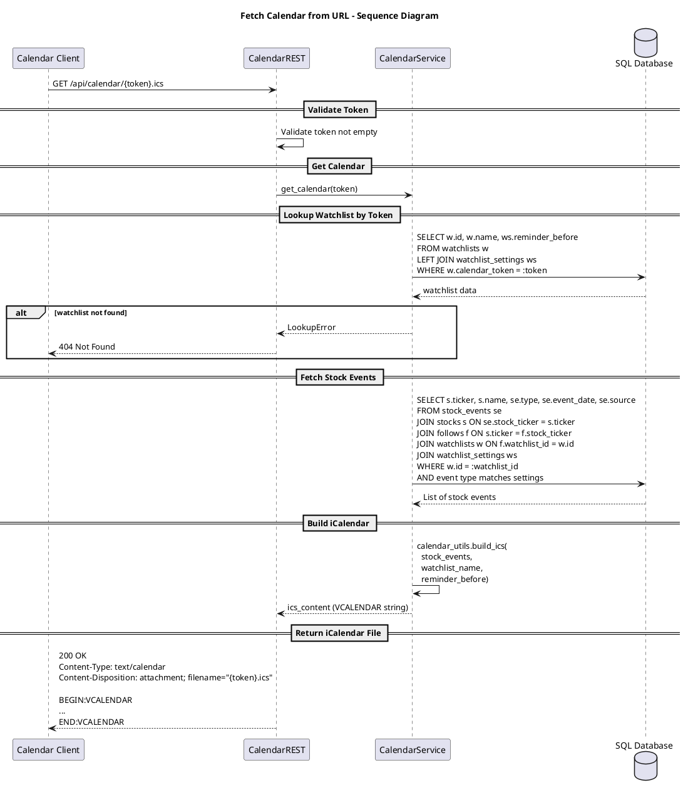

# Fetch Calendar from URL

This diagram shows how calendar clients retrieve a watchlist's stock events as an iCalendar (.ics) file using a unique token. The system fetches relevant stock events based on watchlist settings and generates a properly formatted iCalendar response.

