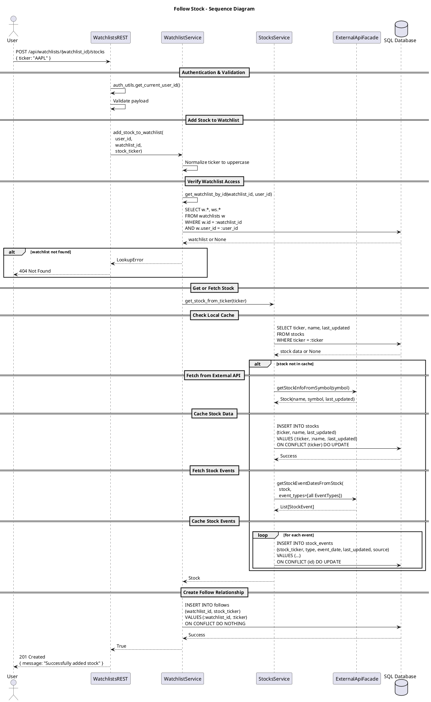

# Follow Stock

This diagram shows the process of adding a stock to a watchlist. The system verifies watchlist ownership, fetches stock information from external APIs if not cached, stores stock events, and creates the follow relationship.

