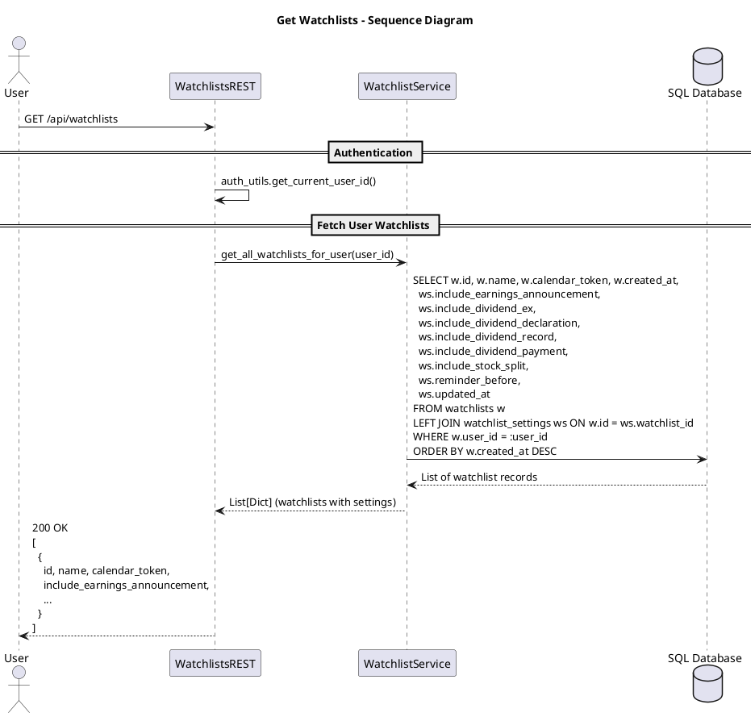

# Get Watchlists

This diagram depicts how the system retrieves all watchlists belonging to an authenticated user. It fetches watchlist data along with their associated settings and returns them sorted by creation date.

