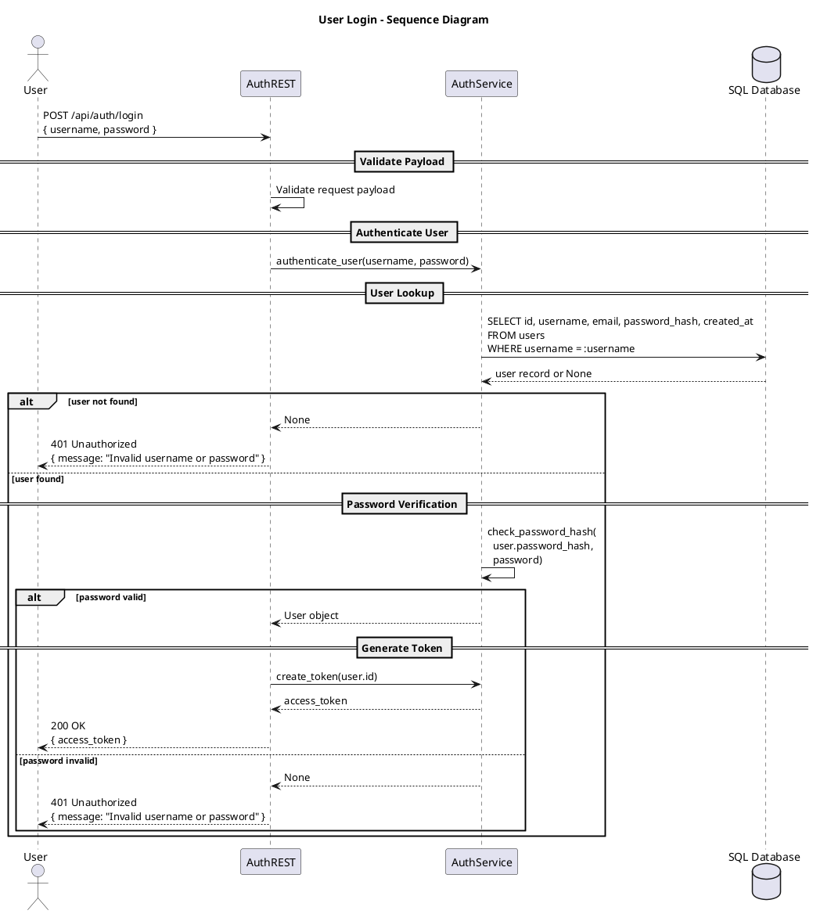

# User Login

This diagram shows the authentication flow when a user logs in with their username and password. The system validates credentials, verifies the password hash, and generates a JWT access token upon successful authentication.

