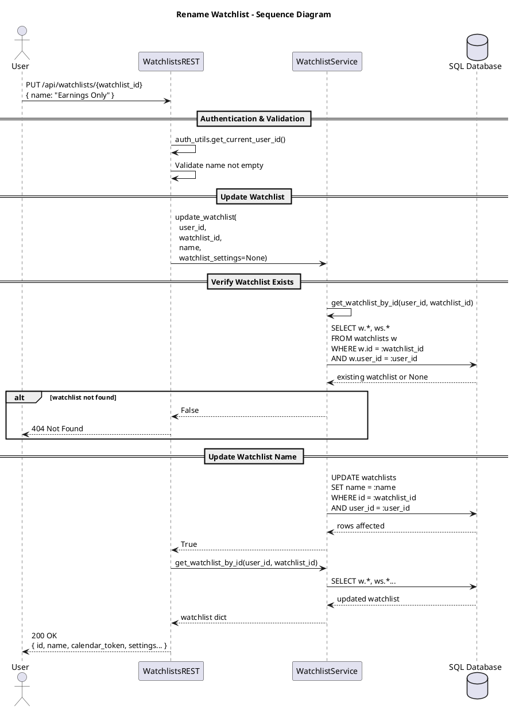

# Rename Watchlist

This diagram shows how a user can rename an existing watchlist. The system verifies ownership, updates the watchlist name in the database, and returns the updated watchlist information.

