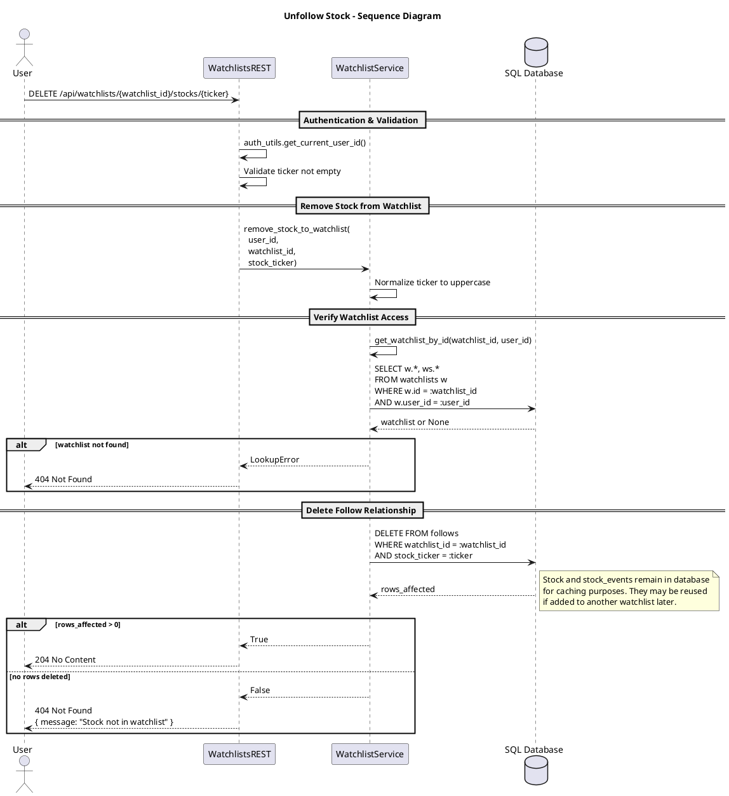

# Unfollow Stock

This diagram illustrates removing a stock from a watchlist. The system verifies watchlist ownership, deletes the follow relationship, while keeping stock data cached for potential future use.

