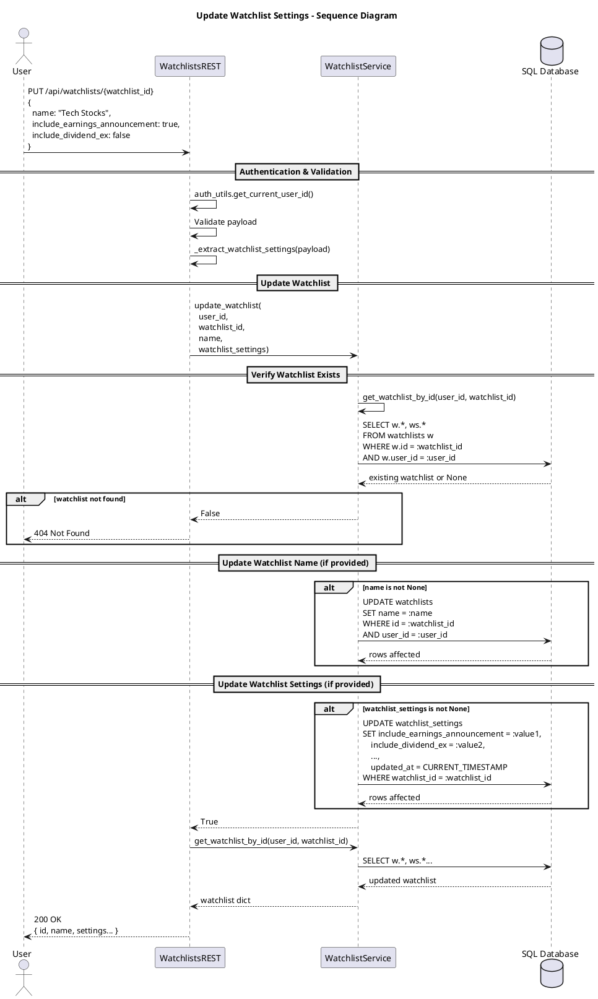

# Update Watchlist Settings

This diagram illustrates updating a watchlist's name and event type preferences (earnings, dividends, stock splits). The system validates ownership, updates both the watchlist name and settings, then returns the complete updated watchlist.

