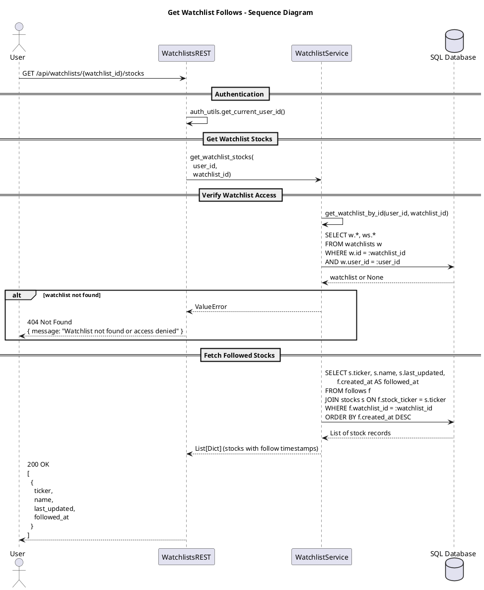

# Get Watchlist Follows

This diagram depicts retrieving all stocks that are followed by a specific watchlist. The system verifies watchlist ownership and returns stock information including ticker, name, and when each stock was added to the watchlist.

